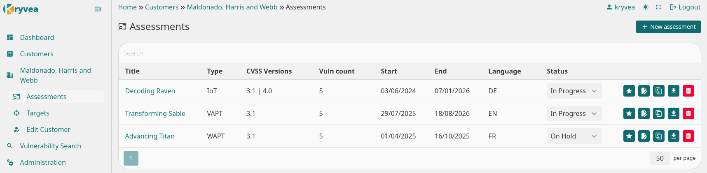
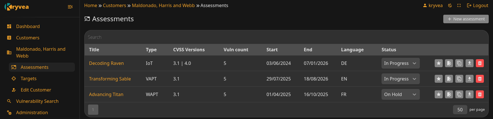

<div align="center">
  <a href="https://github.com/Alexius22/kryvea">
    
  </a>

  <h1>Kryvea</h1>

  <p><b>The reporting platform you never expected</b><br />
  Making it simple and easy to manage penetration tests and generate professional reports</p>

[](https://github.com/Alexius22/kryvea/blob/main/LICENSE)
[](https://github.com/Alexius22/kryvea/releases)

</div>

## 📖 Documentation

**Full documentation is available at: [Kryvea Documentation](https://alexius22.github.io/kryvea/)**

- **[Installation Guide](https://alexius22.github.io/kryvea/installation)** - Setup and deployment
- **[Usage Guide](https://alexius22.github.io/kryvea/usage)** - Complete workflow walkthrough
- **[Templating Guide](https://alexius22.github.io/kryvea/templating)** - Custom report templates
- **[Configuration](https://alexius22.github.io/kryvea/configuration)** - Advanced settings
- **[Troubleshooting](https://alexius22.github.io/kryvea/troubleshooting)** - Common issues & solutions

## 🌟 Overview

**Kryvea** is a comprehensive reporting platform designed for security professionals to manage penetration testing assessments, track vulnerabilities, and generate professional reports. Built with modern technologies and a modular architecture, Kryvea streamlines the entire security assessment workflow from customer onboarding to final report delivery.

## 🚀 Quick Start

### Prerequisites

- Docker & Docker Compose installed
- Port 443 available (or configure custom port)

### Installation

```bash
git clone https://github.com/Alexius22/kryvea.git
cd kryvea
docker compose up
```

> Access at https://localhost  
> Username: `kryvea`  
> password: `kryveapassword`

**That's it!** The first startup will build the images and initialize the database.

> **For detailed installation instructions, see [Installation Guide](https://alexius22.github.io/kryvea/installation)**

### UI

Supporting Light and Dark theme

<p align="center">
    <picture>
      
      
    </picture>
</p>

---

## 📋 Usage

> **For complete usage guide, see [Usage Documentation](https://alexius22.github.io/kryvea/usage)**

---

## 📝 License

This project is licensed under the **GNU Affero General Public License v3.0**.

See [LICENSE](LICENSE) file for details.

## 💬 Support

- **[Discussions](https://github.com/Alexius22/kryvea/discussions)** - Ask questions, share ideas
- **[Issues](https://github.com/Alexius22/kryvea/issues)** - Report bugs, request features
- **[Documentation](https://alexius22.github.io/kryvea/)** - Complete guides and references

---

<p align="center">
  If you find Kryvea useful, please consider giving it a star! ⭐
  <br />
  <b>Made with ❤️ for the security community</b>
</p>
